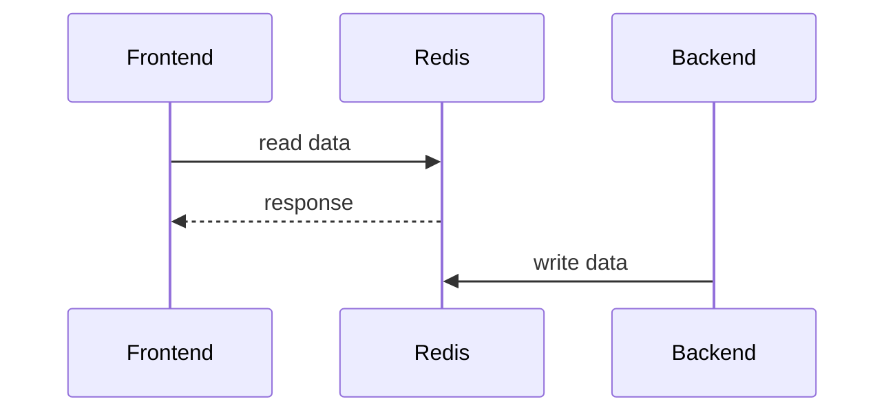

# ASP.Net Core - DistributedRedisCache

## 前言

在開發Web Application時，Redis是很常見的分散式快取服務，因此Microsoft也為了ASP.NET Core準備了Extension套件，只要在一開始的Startup.ConfigureService注入DistributedRedisCache(細節可以參考我強者同事John Wu的<a href="https://blog.johnwu.cc/article/ironman-day20-asp-net-core-caching-redis-session.html" target="_blank">鐵人賽文章</a>)。
<!--more-->

## 先講結論

但是…這裡面其實藏了一個坑，如果只有單純的使用ASP.Net Core+DistributedRedisCache，那很可能不會發現，但如果你的系統架構還有使用到StackExchange.Redis或其他平台的Redis Library去存取相同的Redis，那就要特別注意了。

DistributedRedisCache提供了SetStringAsync()與GetStringAsync()這2個method，對用習慣了StackExchange.Redis的老同學來說，一看到就很直覺的就會對應到IDatabase的StringSetAsync()與StringGetAsync()，問題在於…

***DistributedRedisCache的實作是Hash!***

***DistributedRedisCache的實作是Hash!***

***DistributedRedisCache的實作是Hash!***

很坑人所以講三遍，泥馬的為什麼用了Hash不說啊，這種命名方式真的會讓人搞混…

## 被坑到的讀寫分離

在稍具規模的系統應用Redis做為Cache時，更新Cache的策略就會依各種限制與需求去調整，特別是在讀寫分離的架構下，寫入Redis及讀出Redis會分別交給不同的服務執行。

接下來我們直接實作一下這個架構，來看看為什麼Hash會造成問題

## 架構實作

接下來的實作需要具備的基礎知識：

- 開發環境已安裝好Docker及.Net Core 2.0
- 具備Docker的基礎知識及基本操作能力

### 建立Redis

建立Redis最快的方式就是直接拉一個docker image下來run了，請開啟你的Command Line或Terminal，然後輸入這段指令：


docker run --name MyRedisCache -it -p 6379:6369 redis


這個指令會跑起來一個Redis官方的Docker container，接下來就能做為我們的Cache服務器

### 建立Backend

請建立一個Console的project，從NuGet加入`StackExchange.Redis`，然後在`Programs.cs`加入以下程式碼


static void Main(string[] args)
{
    var mux = ConnectionMultiplexer.Connect("localhost");
    var db = mux.GetDatabase();
    Console.WriteLine($"{DateTime.Now.ToString("yyyy-MM-dd HH:mm:ss")}: Redis connection is established.");

    var key = "MyCache:foo";
    var value = "shared cache data";

    db.StringSet(key, value);
    Console.WriteLine($"{DateTime.Now.ToString("yyyy-MM-dd HH:mm:ss")}: StringSet: key:{key}, value:{value}");
    Console.WriteLine("Press any key to continue...");
    Console.Read();
}


這支小程式負責模擬Backend，寫入Frontend需要的`MyCache:foo`到Redis Cache中

### 建立Frontend

請建立一個ASP.Net Core Web MVC的專案

在`Startup.cs`註冊`DistributedRedisCache`


public void ConfigureServices(IServiceCollection services)
{
    services.AddMvc();
    services.AddDistributedRedisCache(options =>
    {
        options.Configuration = "127.0.0.1:6379";
    });
}


接下來在`HomeController.cs`注入`DistributedRedisCache`，並讀取從Backend寫入的`MyCache:foo`


readonly IDistributedCache cache;
public HomeController(IDistributedCache cache)
{
    this.cache = cache;
}

public IActionResult Index()
{
    var value = cache.GetString("MyCache:foo");
    return View();
}


先執行Backend把`MyCache:foo`寫入Redis後，再執行Frontend，然後…

就會出錯了…XD

### 發生錯誤

從這個錯誤訊息，我們可以得知這是因為沒有使用正確對應的指令去存取Redis，我們直接寫一筆到Redis來看一下好了

改寫`HomeController.cs`的`Index()`


public IActionResult Index()
{
    var value = cache.SetString("MyCache:test");
    return View();
}


然後開啟另一個Terminal，輸入下列指令叫用Redis-cli檢查Redis內存放的`MyCache:test`


docker run -it --link MyRedisCache:redis --rm redis redis-cli -h redis -p 6379


輸入type `MyCache:test`後，如圖所示，我們可以看到這個key的type是hash

### 檢查原始碼

再來看一下Github上的原始碼，看到這個Lua script就瞭了，真的是Hash啊! 因此在方便使用之餘，還是要特別注意這個API命名上不一致的問題，否則在混合其他平台或在ASP.Net Core使用了多種方式存取Redis時，就會遇到很意外的錯誤。


// KEYS[1] = = key
// ARGV[1] = absolute-expiration - ticks as long (-1 for none)
// ARGV[2] = sliding-expiration - ticks as long (-1 for none)
// ARGV[3] = relative-expiration (long, in seconds, -1 for none) - Min(absolute-expiration - Now, sliding-expiration)
// ARGV[4] = data - byte[]
// this order should not change LUA script depends on it
private const string SetScript = (@"
        redis.call('HMSET', KEYS[1], 'absexp', ARGV[1], 'sldexp', ARGV[2], 'data', ARGV[4])
        if ARGV[3] ~= '-1' then
            redis.call('EXPIRE', KEYS[1], ARGV[3])
        end
        return 1");


[DistributedRedisCache 原始碼連結](https://github.com/aspnet/Caching/blob/dev/src/Microsoft.Extensions.Caching.Redis/RedisCache.cs){target:"_blank"}

## 結論

個人覺得這真的是一個未依慣例命名造成的認知問題，如果Method改名成HashGet, HashSet，這篇文章應該就不會存在了。

此外，如果真的要應用在比較具規模的系統，我應該不會選用DistributedRedisCache，而是針對需求另外設計一個介面去包住StackExchange.Redis

原因並不是我愛造新輪子，而是這個內建的元件並無法完全發揮Redis的能力，用在小型系統應該問題不大，但在讀寫分離的場景或是混合架構時，先天的限制就會很明顯了。