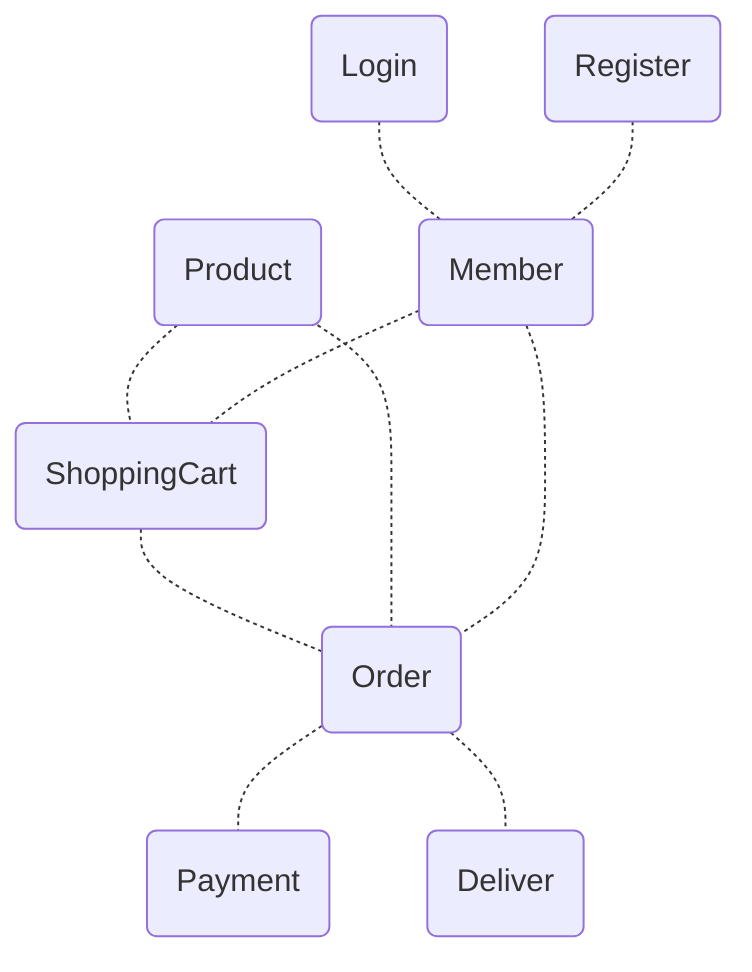

# 需求決定架構

一開始就直接破題了，軟體架構不是看著國內外大神分享的架構簡報抄一遍就好，也不是完全靠經驗決定架構怎麼設計。

所有的架構設計都是由需求決定，我指的需求不單單指需求規格書上的`功能性需求(Funtional Requirements)`，還包括了很容易被忽視的`非功能性需求(Non-Functional Requirements)`與`約束(Constraints)`。
<!--more-->

## 需求如何影響架構

一個軟體專案的失敗原因很多，但追根究柢還是肇因於對需求沒有共識。

同樣的，一個軟體系統架構設計的好與壞，也是取決於架構師對這幾類需求的理解有多透徹。

### 功能性需求

功能性需求會影響的是職責與協作，不同的功能我們會依其所屬的Domain特性進行分類，且要決定它們之間如何溝通，既要降低耦合，還要提高內聚。

舉例來說，一個線上購物網站是一個大的domain，裡面會涉及很多Sub domain，不同的Sub domain彼此協同合作並組合成一個系統，Sub domain可能還會再拆分成不同的模組，模組與模組之間的溝通就需要決定交換資訊的方式。

### 約束

在談非功能需求之前，得要先談`約束`，因為非功能需求決定的是品質，而約束決定的是這個架構現不現實，靠不靠譜，而且非功能性需求大多時候是要將功能性需求+約束條件放在一起看，才能決定哪些非功能性需求可以被滿足。

什麼是約束? **約束指的是所處的環境下，無法改變或改變成本過高的遊戲規則**

舉例來說，老闆或客戶壓下來的時程、政府法規、公司可用資金、團隊技術能力、舊有系統架構包袱…等等，是一種`環境限制`。

因此，設計架構時不能不考慮這些約束，不然就很容易成為`太空架構師`或`神級架構師`，因為你提的架構也許很厲害很強大，但無法落地的架構要嘛就是一直不落地，要嘛就是修修改改後有很高的概率成為所有人的惡夢。

### 非功能性需求

Non-Functional Requirements(NFRs)決定的是`品質`

品質不是測試出來的，軟體系統的品質天花板取決於架構設計滿足多少非功能性需求，因此非功能性需求又被稱為`品質屬性`。

可是架構設計最難的地方就在這，因為這些NFRs很多是彼此互斥的，再加上約束條件的環境限制，不可能每項都滿足，因此就必須做出取捨(Trade-off)。

舉例來說，Performance很重要，如果想要讓交易寫入DB的效能最大化，就是把相關的Table集中在同一個DB，使用Stored Procedure並減少不必要的索引，但這樣以DB為主的架構不易Scale out只能Scale up，因此Scalability就跟Performance及Capacity產生互斥，短期可能系統比較快上線，但長期會造成其他問題增加成本。

可是如果採用分散式的做法，以現有的Schema設計，又會面臨Data integrity與Performance可能無法滿足，那還要再加上Schema的架構調整…。

看起來挺糾結的，是吧?

## 架構師要懂的需求結構化

說完了這三類需求，那架構師該怎麼生存下去? 要求寫需求規格書的需求分析師把這些寫進去肯定不現實，再退一步講，架構師不能依賴文件，尤其是需求規格書。

以前我很依賴需求規格書，但實際的軟體開發與設計經驗告訴我，這樣的架構設計無法建構在完整的大局觀之下，後續的不良影響會很深遠。首先，需求分析師很多都不是技術背景出身，並不那麼理解功能性需求、約束與非功能性需求之間是如何互相影響。再者，需求分析師訪談的對象往往只是使用者，拿的是使用者需求，觀點被侷限住了，使用者通常很難告訴我們系統要如何易於擴展，效能要多好才符合未來的業務成長，因此需求規格書內就很不容易把這部份的需求寫的很清楚。

但沒關係，這也不是需求分析師的錯，需求規格本來就得要經過討論溝通，我們使用文件但不依賴文件，分門別類把需求結構化，然後有系統的去分析它們造成的影響。

架構設計要分析的需求不是全部需求項目都拿出來分析，要分析的只有關鍵需求，那是整個架構設計需做出取捨最關鍵的部份，另一方面架構設計愈早開始愈好，等到需求規格書要寫完，專案差不多已經進開發階段了，這時才開始做架構設計就太慢了。

前面提到需求分三類，但沒提到的是角色，角色包括`組織`、`使用者`、`開發團隊`、`維運團隊`四類，這四類分別代表了不同的層面與觀點，而架構設計就是要從這四個層面逐步找出關鍵需求。

- 組織層面
  - 需求：Business Goal
    - 跨境電商平台網站
    - 提升不同地區的市佔率
    - 未來能快速增加相關的營運項目
  - 約束：組織層面的約束
    - Time to market
    - 可用資金
    - 法規限制
    - 24H持續營運
- 使用者層面
  - 需求：各種使用者觀點的功能性需求
    - 物流：與當地物流整合
    - 行銷企畫：靈活的地區促銷管理
    - 營運：多種銷售平台
  - 約束：使用者層級約束
    - 支援多國語言
    - End user的使用習慣
    - 物流商整合技術能力薄弱
- 開發團隊層面
  - 需求
    - 系統易於擴展整合
  - 約束
    - 開發團隊人力有限
- 維運團隊層面
  - 需求
    - 容易且快速的部署方式
    - 靈活的Alert設定
  - 約束
    - 主機虛擬化，管理系統數量龐大

這四個層面可以先由上而下，逐步找出關鍵需求與約束，然後再依關鍵需求與約束的邏輯推導出`使用者層級的關鍵非功能性需求`。

一樣舉個例子來看一下：

||功能性需求|約束|使用者層級|非功能性需求|
----|----|----|----|----
|組織|跨境電商平台網站|24H持續營運|營運|高可用性, 高安全性|
||||End user|性能(Response time)
|物流|與當地物流整合|物流商整合技術能力薄弱|物流商IT|整合API易用性, 重用性

為什麼一定要是使用者層級的? 在整理關鍵需求及推導關鍵非功能性需求時，通常會遇到衝突的需求，架構師得要知道取捨，我的觀點是**一切需求都有其業務價值，唯有用同一種價值單位才能對這些需求的優先級進行排序**，因此你在取捨時才有依據。

如果這些需求被定位成技術需求而不是業務需求，那麼在需求排序時就會因為標準不一，很容易被犧牲掉，對架構設計的取捨也就沒有依據，你有很大的可能性做出錯的架構設計。

## 結論

很少人會談需求跟架構設計的關係，寫架構Pattern的很多，照著搬常會砸到自己的腳，還是要回到有需求才有架構設計，只是需求一直很難說的清楚，特別是在非功能性需求的部份，要先探索需求，然後跟寫程式一樣找出需求規格，最後驗證它的可行性。

## 後記

這篇文章我覺得真的很難寫，因為知道該怎麼做是一回事，但要有條理的寫出來又是另一回事，要一直梳理想法跟做法，但這個過程對我個人的幫助真的很大，有些模糊的想法也變的比較具體，在架構設計也有了一些新的領悟。