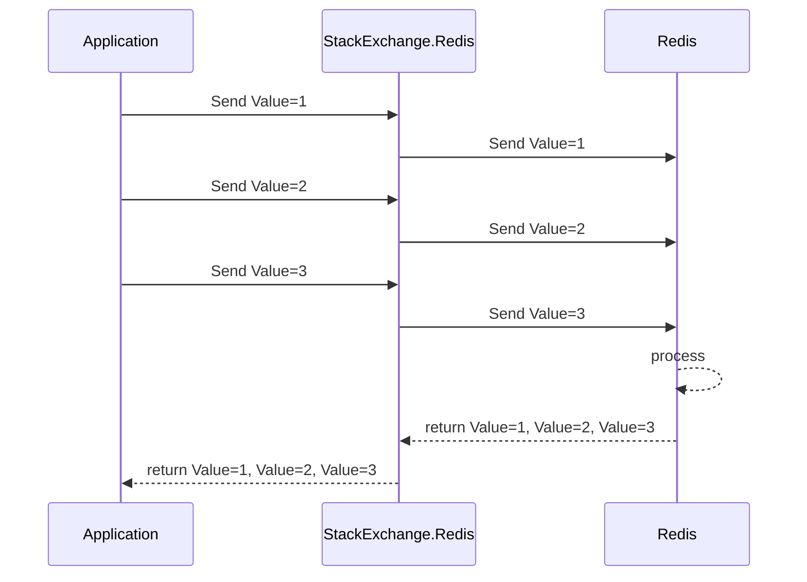
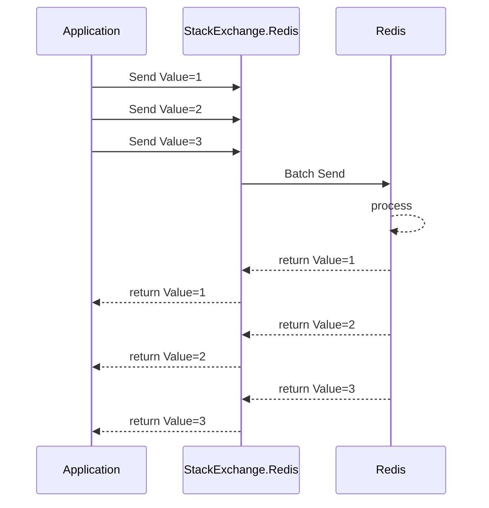

# C#存取Redis

這篇算是Redis系列第二篇，內容會儘量涵蓋存取Redis需要注意的一些基本知識及除錯

## Redis的特性

在Redis系列第一篇有提到Redis是一個效能極好且穩定性很高的In-Memory的NoSQL database，它有幾個特性是我們需要知道的：

- 以ANSI C開發，穩定
- 資料儲存在Memory中處理，減少了Disk I/O
- Single Thread I/O Multiplex
- 提供AOF/RDB 2種持久化方式

<!--more-->

還有一些其他的功能比如Pub/Sub、叢集之類的就先不講了，這邊要特別重點解釋Single Thread I/O Multiplex

Redis是Single Thread，這點很重要請牢記，也就是說不管Server上有幾個CPU core，1個Redis instance就是只會用到1個CPU core，而且因為只有1個CPU core，它是無法同時運算多個request的。因此，如果有1個request佔用了太長的CPU時間，就會導致Redis無法回應其他connection送過來的request，這是一開始使用Redis的開發人員很常會犯的錯誤之一，就是把它當成傳統的RDBMS在用，導致效能低落甚至系統crash的都有。

那麼為什麼Redis只有Single thread但卻能有極高的throughput呢? 那就不得不提一下很重要的`Multiplex`，中文翻做多路複用，這在之後要使用的StackExchange.Redis中也是很重要的概念。

I/O Multiplex是一種Socket I/O的處理模型，特性是用單一個Thread就可以同時處理多個Connection。


Redis預設是用epoll的方式來實現，而epoll本身還有幾個特點是只處理Active connection、不限制連線數及Zero copy，因此在處理大量socket connection的效率極好。

## 常用的Redis資料結構介紹

Redis提供了好幾種資料結構，比較常用到的是String、Hash、List、Set、SortedSet這5種，另外還有特殊用途的HyperLogLog及Geo。

- String是最簡單的Key/Value結構
- Hash是一種Map結構，以.Net來說就像是HashTable，一個Key底下可以存放N個Key/Value
- List跟.Net裡的List不一樣，是類似Queue或Stack的結構，以加入List的順序排序
- Set則是一種沒有排序的集合
- SortedSet是加上排序功能的Set，但跟List不一樣的是排序依給定的權重值來排
- HyperLogLog 我個人覺得它有點不算是結構，應該算是一種演算法，用在個數估算用的
- Geo 顧名思義，這是放經緯度的，可以拿來算2點之間的距離或是做跟地圖相關的應用

## StackExchange.Redis

這是目前.Net圈子最有名、最多人使用的Redis client，也是Redis官方推薦的.Net client，作者是在StackExchange工作的Marc Gravel，目前最新的版本支援到Redis 4.0

- [Github](https://github.com/StackExchange/StackExchange.Redis){:target="_blank"}
- [NuGet](https://www.nuget.org/packages/StackExchange.Redis/){:target="_blank"}

StackExchange.Redis也實作了`Multiplex`，也就是說它對Redis也是只建立一條connection，然後透過Multiplex多路複用去服務大量的請求，這在高並發的Web應用場景非常的實用。假設沒有實作這個機制，當同時有30個request要去存取Redis時，就必須建立30條connection，然後你不曉得何時資料會回來，於是就要輪詢這30條connection，這會造成很大的延遲，而或許也可以使用Connection pool技術，讓連線可以被重用，但就需要去管理Connection pool。

因為Redis設計成single thread的關係，無論採用輪詢還是Connection pool，對存取Redis來說都不是很理想的設計，但Multiplex可以很好的解決這些問題，它可以有效的降低waiting，儘可能的讓共用的connection塞滿指令與資料。

### 建立連線與基本用法

使用StackExchange.Redis建立連線很簡單，傳入一個連線字串就好了，大部份的參數都有預設值


var redis = ConnectionMultiplexer.Connect("172.16.49.188:6379");
var db = redis.GetDatabase();
db.StringSet("foo", 1688);


上面這段code會建立一個連線物件並建立對Redis的連線，連線建立完成後會建立Database實體，然後就可以叫用Database實際操作Redis進行存取。

這裡有幾個重要的點要講:

- 連線管理

前面有提到StackExchange.Redis使用Multiplex處理連線問題，同時也沒有Connection pool的設定，所以StackExchange.Redis的連線並不能像使用Database一樣，用using來建立與釋放，這是很多初碰Redis的新手很常犯的錯誤之一。


// 注意! 這是錯誤的寫法
using (var redis = ConnectionMultiplexer.Connect("172.16.49.188:6379"))
{
    var db = redis.GetDatabase();
    db.StringSet("foo", 1688);
}


比較正確的寫法是另外用一個Singleton的寫法包起來，如以下範例程式碼，使用`Singleton`的design pattern避免一直重複建立連線物件，因為建立TCP連線是很重的開銷，頻繁的銷毀/重建會造成嚴重的效能問題。


using System;
using StackExchange.Redis;

namespace RedisExample
{
    class Program
    {
        static void Main(string[] args)
        {
            RedisConnection.Init("localhost:6379");
            var redis = RedisConnection.Instance.ConnectionMultiplexer;
            var db = redis.GetDatabase(0);

            Console.WriteLine("Hello World!");
            Console.Read();
        }
    }

    public sealed class RedisConnection
    {
        private static Lazy<RedisConnection> lazy = new Lazy<RedisConnection>(() =>
        {
            if (String.IsNullOrEmpty(_settingOption)) throw new InvalidOperationException("Please call Init() first.");
            return new RedisConnection();
        });

        private static string _settingOption;

        public readonly ConnectionMultiplexer ConnectionMultiplexer;

        public static RedisConnection Instance
        {
            get
            {
                return lazy.Value;
            }
        }

        private RedisConnection()
        {
            ConnectionMultiplexer = ConnectionMultiplexer.Connect(_settingOption);
        }

        public static void Init(string settingOption)
        {
            _settingOption = settingOption;
        }
    }
}


- 連線設定

StackExchange.Redis提供了很多的連線參數設定，你可以把所有的設定放在一個字串變數內，建立ConnectionMultiplexer時傳進去，例如：

```csharp
var redis = ConnectionMultiplexer.Connect("redis0:6380,redis1:6380,password=test");
```

或是建立`ConfigurationOption`物件後再傳入

```csharp
var options = ConfigurationOptions.Parse("redis0:6380,redis1:6380,password=test");
var redis = ConnectionMultiplexer.Connect(options);
```

詳細的設定參數說明請參考 [StackExchange.Redis Configuration](https://stackexchange.github.io/StackExchange.Redis/Configuration){:target="_blank"}

### FireAndForget、Async及Batch

StackExchange.Redis的底層實作其實都是走Pipelines，所以不同的thread的指令在client端不會互相阻塞，但如果指令在server端花了較長的時間，依然會影響到全部的連線。

實際在使用時我們可以選擇同步或非同步的方式存取，只是很多人會搞不清楚`FireAndForget`、`Async`及`Batch`這三者的差異，開發時沒有正確的使用，上線後就很容易出現一些奇奇怪怪的Timeout exception。

先講Async，其實就是Pipelines，指令的執行結果以Task回傳，不會阻塞調用的執行緒，指令以Async()結尾，例如`GetAsync()`, `HashSetAsync()`。



Batch，非同步的批次處理，但這個批次是會先queued在StackExchange.Redis內部的一個command queue，當你呼叫Batch.Execute時才整批指令發送出去。



注意，這個整批指令因為是一整個block發送，會阻塞當下的執行緒

FireAndForget，這是一個比較不太一樣的方式，不需要使用Async()結尾的API，StackExchange.Redis會在指令發送後，不管Redis那邊處理的狀況如何，依據呼叫的API的回傳型別，立即返回一個Default的Object，在client端的throughput是最高的，因為完全不管回傳值，使用的方式比較不一樣，要指定參數才可以使用。

```csharp
var redis = ConnectionMultiplexer.Connect("redis0:6380");
var db = redis.GetDatabase();
db.StringSet("foo", "test", null, When.Always, CommandFlags.FireAndForget);
```

當指定最後的參數為`CommandFlags.FireAndForget`，StackExchange.Redis就不會管是不是真的有回傳，直接return一個Default(T)給你

## 小結

這篇算是上半篇入門，還有一些內容如Lua script、Trouble-shooting等會在下半篇寫完。

程式碼相關的部份都很簡單，但一些主要的基礎觀念很重要，會影響到Redis能不能用的好，如對文章內容有建議或是不清楚的部份，歡迎留言討論。