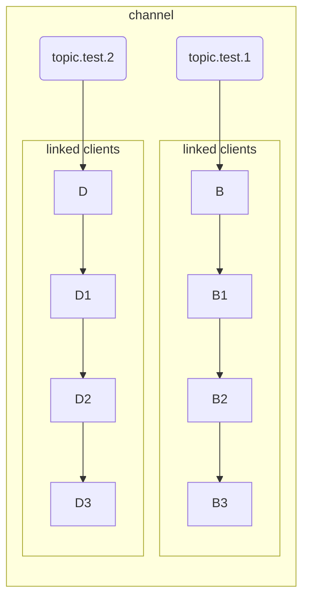

# C#存取Redis

延續上一篇[Redis系列 - C#存取Redis (上)]()，這篇文章會說明Redis的簡易Publish/Subscribe、Lua script的基礎知識。

## PUBLISH/SUBSCRIBE

Redis的PUB/SUB是很簡易的訊息機制，並不像一些專門的Message Middleware(例如RabbitMQ、ActiveMQ)提供很多豐富的功能，比如它就不保證訊息發送後一定不會遺失，但因為附帶的這個功能實在太方便了，實務上還是經常使用到。

<!--more-->
StackExchange.Redis對PUB/SUB的支援很完整，範例程式碼如下

***`RedisConnection`的程式碼請參考[Redis系列 - C#存取Redis (上)]()***

### StackExchange.Redis PUB/SUB 範例程式碼

```csharp
RedisConnection.Init("localhost:6379");
var redis = RedisConnection.Instance.ConnectionMultiplexer;
var db = redis.GetDatabase(0);
var sub = redis.GetSubscriber();
Console.WriteLine($"{DateTime.Now.ToString("yyyy-MM-dd hh:mm:ss.fff")} - Subscribed channel topic.test ");
sub.Subscribe("topic.test", (channel, message) =>
{
    Console.WriteLine($"{DateTime.Now.ToString("yyyy-MM-dd hh:mm:ss.fff")} - Received message {message}");
});

redis.GetDatabase().Publish("topic.test", "Hello World!");
Console.WriteLine($"{DateTime.Now.ToString("yyyy-MM-dd hh:mm:ss.fff")} - Published message to channel topic.test");
```

**執行結果:**


### PUB/SUB的實作結構特性

使用Redis的PUB/SUB要注意幾件事，同樣的Channel如果不先呼叫`Unsubscribe()`就呼叫`Subscribe()`，每Publish一次就會收到重覆的message。

這是因為Channel在Redis的實作上是一個Dictionary的結構，Key值是Channel，Value是一個Linked List，這個Linked List存的是有訂閱這個Channel的Client Id，因此每呼叫一次`Subscribe()`，就會往這個Linked List增加一個Client Id。



由於使用Linked List的關係，訊息傳遞的時間複雜度是O(N)，如果同一個Channel有很多個Subscriber，排愈後面的Subscriber就會愈慢收到，但這個問題可以用多個Channel來解決。

### 非同步的訊息順序問題

另外StackExchange.Redis預設也提供了`Publish()`與`PublishAsync()`，但實際呼叫時會發現結果似乎是一樣的

```csharp
for (int i = 0; i < 10; i++)
{
    redis.GetDatabase().PublishAsync("topic.test", $"{i} Hello World!");
    Console.WriteLine($"{DateTime.Now.ToString("yyyy-MM-dd hh:mm:ss.fff")} - Published message to channel topic.test");
}
```

**執行結果:**


這是因為StackExchange.Redis預設是讓訊息的發送與接收在同一個Connection維持一致的順序，這像是queue的概念，這樣做的好處是有利於簡化訊息的處理順序問題，但缺點是必須一個一個的發送與接收，如果訊息量較大時，就會造成delay。

因此若不需要關心每個訊息的處理順序，可以調整一個設定值，讓`PublishAsync()`發揮非同步的能力

```csharp
redis.PreserveAsyncOrder = false;
for (int i = 0; i < 10; i++)
{
    redis.GetDatabase().PublishAsync("topic.test", $"{i} Hello World!");
    Console.WriteLine($"{DateTime.Now.ToString("yyyy-MM-dd hh:mm:ss.fff")} - Published message to channel topic.test");
}
```

**執行結果:**


不限制非同步訊息的順序，會提昇訊息處理的Throughput，但就要自己控制訊息對系統狀態的影響。

### Output buffer Hard limit/Soft limit對PUB/SUB的影響

最後還有一個Pub/Sub的坑要特別提一下，在使用Pub/Sub時，如果Publisher的發送量大於Subscriber的消化速度的話，會有機會被Redis關閉client端的連線。

Redis對每一個連上來的client端都有一個output buffer的設定，這是因為Redis的In-memory處理速度太快，而Network的I/O處理太慢，因此需要一個緩衝區讓Redis處理完請求後先將結果放進去，就可以繼續處理下一個請求。

Output buffer分成三種，預設值如下:

```conf
client-output-buffer-limit normal 0 0 0
client-output-buffer-limit slave 256mb 64mb 60
client-output-buffer-limit pubsub 32mb 8mb 60
```

可以看到pubsub有特別獨立出來一個設定值，其中的32mb是`hard limit`，8mb是`soft limit`，60是soft limit的時間限制。這個設定值的意思是如果pubsub的訊息大於32mb時，Redis會立刻關閉該client的連線，8mb與60是指如果達到8mb且超過60s，就會關閉該client的連線。

## Lua script

Redis在2.6版就加入了對Lua script的支援，Lua script是一種非常簡單的腳本語言，被廣泛的用在很多軟體內做為內嵌語言，遊戲引擎內就很常看到它的出現。

使用Lua script的好壞處都很明顯，個人覺得是有些兩面刃的味道，用的好可以完全發揮Redis的優點，用不好也可以徹底搞死Redis…。

### 適用場景

還是要回到Redis的架構設計來看，因為單執行緒的設計，在運行Lua script的時候是沒辦法處理其他的請求的，所以Lua script並不能像Database的Stored Procedure一樣運行複雜的商務邏輯，它適用的場景是：

- 組合出Redis沒有支援的command
- Atomic的資料操作
- Transaction
- 避免多次請求來回浪費掉的round-trip network latency

蠻多工程師一開始接觸Redis並不清楚這個部份，發現Lua script的一些優點後，就會把Lua script當成DB的SQL在用，寫了一堆Lua script像是在寫stored procedure，放了很多複雜的商業邏輯在內，在開發環境可能還不會遇到問題，但在上到正式環境後就陸續發生一大堆效能問題，這時要再緊急上的Patch就很容易出現其他的bug。

### StackExchange.Redis 執行Lua script 範例程式碼

使用StackExchange.Redis呼叫Lua script的方式有好幾種不同的方式，使用上都是大同小異。

我寫了一個示範用的lua script，功能是先產生100筆key，然後依據查詢條件找出符合的key，這邊傳入的參數我用`@key`及`@value`，稍後在C#的code就會用到了，請存成script.lua並放到你的專案中。

```lua
local cursor = 0
local values = {}
local match = @key
local count = @value
local result = {}
local done = false
-- 這個迴圈會寫入100個key
for i=1,100 do
    redis.call("set", "test:"..i, i+1)
end

-- 呼叫 SCAN, 並依據傳入的key pattern與每次查詢筆數, 逐次讀取符合條件的key存入table
repeat
    local searchResult = redis.call("SCAN", cursor, "MATCH", match, "COUNT", count)
    cursor = searchResult[1];
    values = searchResult[2];
    for i, val in ipairs(values) do
        table.insert(result, val)
    end
    if cursor == "0" then
        done = true;
    end
until done

--排序後回傳結果
table.sort(result)
return result
```

C#的部份我也寫了一個RunLuaScript()的私有靜態方法，請注意傳入的參數名稱`key = (RedisKey)"test:*", value = 5`，這必須跟Lua script接的`@key`及`@value`同名，這是LuaScript class提供的功能，如果型別是`RedisKey`的話，會幫你轉成`KEYS[]`，否則的話轉成`ARGV[]`。

```csharp
static void Main(string[] args)
{
    var redisHost = "localhost:6379";
    RedisConnection.Init(redisHost);
    var redis = RedisConnection.Instance.ConnectionMultiplexer;
    var db = redis.GetDatabase(0);
    var result = (string[])RunLuaScript(redis, db, redisHost).Result;
    foreach (var item in result)
    {
        Console.WriteLine(item);
    }

    Console.Read();
}

private static async Task<RedisResult> RunLuaScript(ConnectionMultiplexer redis, IDatabase db, string defaultServer)
{
    return await LuaScript
        .Prepare(File.ReadAllText("script.lua"))
        .Load(redis.GetServer(defaultServer))
        .EvaluateAsync(db, new { key = (RedisKey)"test:*", value = 5 });
}
```

這段程式碼還有呼叫了`Load()`，這會把Lua script先載入指定的Redis server，一般指定Master就可以了，會自動replicate到Slave。載入後會拿到一個SHA1 hash code，之後執行時只需傳入這個code，不需重傳整份Lua script，對需要頻繁執行的script有效能上的幫助。

### Lua script的Debug方式

Lua script因為是運行在Redis上，所以在3.2版推出之前，Debug一直是比較麻煩的部份，但作者在3.2版提供了debug mode，方便開發人員在開發階段進行除錯。

testDebug.lua

```lua
local key = KEYS[1]
local data = ARGV[1]
redis.call("SET", key, data)
return redis.call("GET", key)
```

我寫了一個很簡單的Lua script並存成testDebug.lua，接下來要透過Redis-cli這支命令列程式來執行這個script，但參數加上`--ldb`，這是告訴Redis接下來以debug模式執行這支Lua script。

```bash
docker exec -it redis redis-cli --ldb --eval /tmp/lua/testDebug.lua "foo" , "bar"
```

執行後會進入debug模式，接下來可以輸入`s`單步執行，或是輸入`p`顯示所有的變數值。

Debug模式提供了蠻多的指令方便開發人員除錯，**但要注意不要在正式環境執行`--ldb`**，因為Debug模式是一種阻斷模式，所有的請求都會被這個session阻塞住，可想而之在正式環境加上這個參數絕對會搞死系統的(如果你的系統邊緣到根本沒人用就又另當別論了…)。

```shell
jed@Jed-MacBook-Pro:~/Workspace/code/lua% docker exec -it redis redis-cli --ldb --eval /tmp/lua/testDebug.lua "foo" , "bar"
Lua debugging session started, please use:
quit    -- End the session.
restart -- Restart the script in debug mode again.
help    -- Show Lua script debugging commands.

* Stopped at 1, stop reason = step over
-> 1   local key = KEYS[1]
lua debugger> s
* Stopped at 2, stop reason = step over
-> 2   local data = ARGV[1]
lua debugger> s
* Stopped at 3, stop reason = step over
-> 3   redis.call("SET", key, data)
lua debugger> p
<value> key = "foo"
<value> data = "bar"
lua debugger>
```

除了運行`--ldb`以外，當然還有其他的方式可以幫助除錯，例如：

- 在Lua script內呼叫redis.log()，把需要記錄的除錯訊息寫入Redis的log file
- 用List當log，因為List是一直append的，符合log的特性
- 使用專門的Lua script editor協助除錯，例如ZeroBrandStudio

ZeroBrandStudio是一個蠻好用的Lua script IDE，使用方式可以參考我同事小黑寫的這篇<a href="https://blackie1019.github.io/2018/05/01/Write-Redis-Lua-Script-with-ZeroBrane-Studio/" target="_blank">Write Redis Lua Script with ZeroBrane Studio</a>

因為我個人比較習慣用VSCode，所以就沒有用ZeroBrandStudio，但它用來除錯的確蠻方便的。

## 小結

這一篇儘量把PUB/SUB與Lua script基礎的部份講完，包含了一些實務上可能會遇到的問題，因內容有些多，所以Trouble shooting的部份就留待下一篇再講了。如果有任何意見，歡迎留言討論。